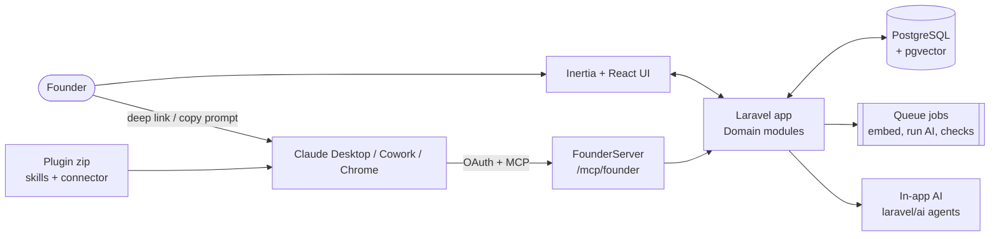
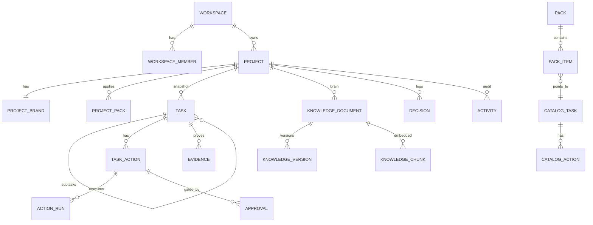
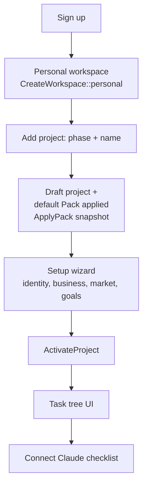
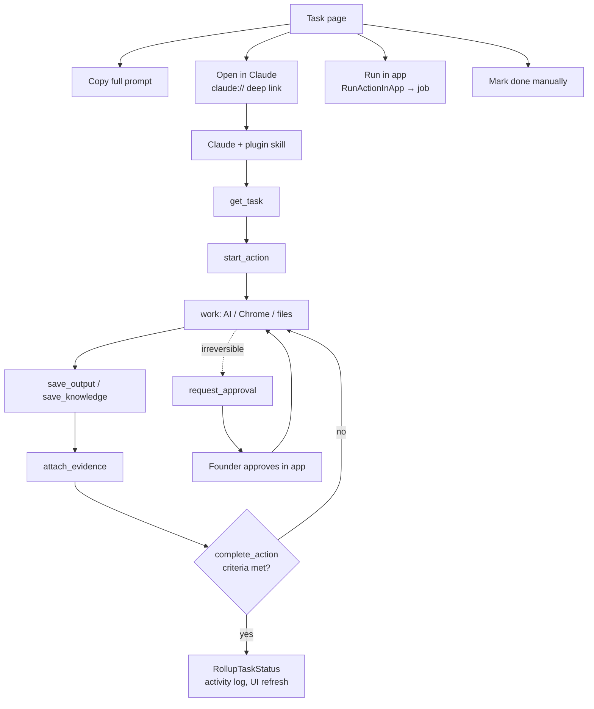
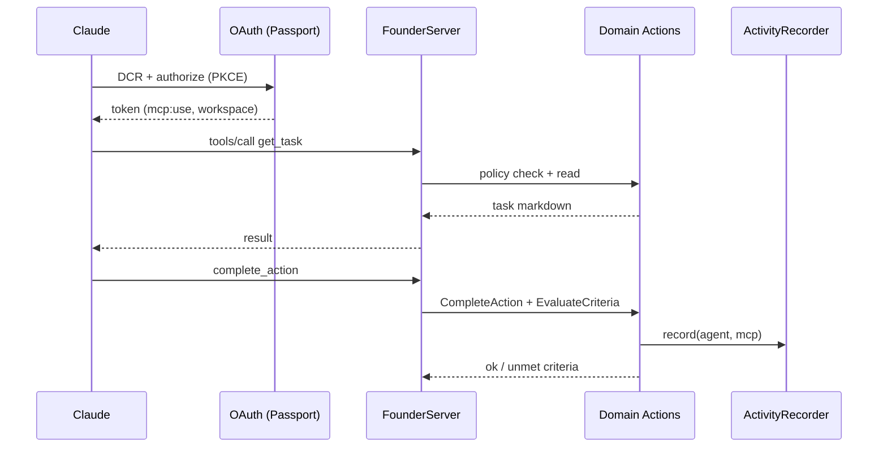

# Founder OS — How It Works

Founder action planner. Founder creates a **Project**, gets a **Pack** of tasks, and executes them with **Claude** (through MCP + skills), the **in-app AI**, or by hand. App = source of truth.

> **Skill = how · MCP = data & state · Prompt = what now · App = truth.**

Specs: `docs/PROJECT_CONTEXT.md`, `DATA_MODEL.md`, `MCP_AND_SKILLS.md`, `docs/plans/*`.

---

## 1. Stack

| Layer | Tech |
| --- | --- |
| Backend | Laravel 13, PHP 8.5, PostgreSQL 16 + pgvector |
| Frontend | Inertia v3 + React 19, Tailwind 4, shadcn/coss UI, Wayfinder, Tiptap, react-markdown |
| Auth | Fortify (login, 2FA, passkeys) + Passport (OAuth 2.1 for MCP) |
| AI bridge | `laravel/mcp` server, `laravel/ai` agents |
| Realtime | Pusher broadcasting + Echo (`ProjectChannel`, `use-project-channel`) |
| Quality | Pest, Pint, Larastan, `composer ci:check` |
| Dev tooling | Laravel Boost (MCP), Claude skills in `.claude/skills` |

---

## 2. System map



---

## 3. Domain modules (`app/Domain/*`)

Each module: `Models, Enums, Actions, Queries, Data, Http, Policies, Console, Jobs`.

| Module | Owns |
| --- | --- |
| **Workspace** | Tenancy, members, roles (owner/admin/member/viewer), invitations, `BelongsToWorkspace` fail-closed scope |
| **Project** | Project profile, brand, setup wizard, packs applied, context snapshot |
| **Catalog** | Authored library: categories, tasks, actions, prompt templates, skills, resources, packs. YAML → `catalog:import` |
| **Task** | Tasks tree, TaskActions, ActionRuns, Evidence, Approvals, status rollup, scheduling |
| **Knowledge** | Docs + versions, chunks + embeddings, decisions, interviews, competitors |
| **Prompt** | Launcher prompt, full prompt, deep-link builder |
| **Activity** | `ActivityRecorder` audit log |
| **Comment** | Task comments, mentions, notifications |
| **Media** | Uploaded images/files (`media://` in Markdown) |
| **Analytics** | Completion stats |

Outside domains: `app/Mcp` (server), `app/Ai` (agents), `app/Checks` (machine checks), `app/Actions/Fortify`.

### Conventions

- ULID keys on exposed models. Catalog uses bigint.
- Status changes only in `Actions` classes via `forceFill()`. Never mass-assigned.
- Every mutation calls `ActivityRecorder::record()`.
- Controllers thin: authorize → FormRequest → Action → `Inertia::render()` / redirect.
- Tenant routes under `/{workspace}/…` (`routes/workspace.php`, `routes/projects.php`).

---

## 4. Data model (core)



- **Catalog** = read-only template. **Task** = project **snapshot** with `catalog_version`. Custom edits never overwritten silently; "Update available" diff via `UpgradeTaskFromCatalog`.
- **TaskAction** types: `ai, research, browser, document, file, mcp, check, input, approval, manual, wait, scheduled`.
- **Executors**: `claude_desktop, claude_chrome, app_ai, app_system, user`.

### Status model

- Action: `pending → ready → running → awaiting_input | awaiting_approval → done | failed | skipped`
- Task: `locked · todo · in_progress · blocked · awaiting_approval · done · skipped`
- Task auto-done when all required actions done/skipped. Parent progress = mean of leaf `progress_pct`.
- Verification: `self_reported | evidence_attached | verified`.

---

## 5. Key flows

### 5.1 Onboarding



### 5.2 Executing a task



### 5.3 Knowledge ingestion + search

`SaveDocument` → version row → `EmbedDocumentJob` → `ChunkDocument` (heading-aware) → `knowledge_chunks` (vector 1536 + tsvector). Search = vector + full text, always `project_id` scoped. `BuildContextSnapshot` rebuilds `projects.context_snapshot_md` (≤ 6000 chars).

### 5.4 In-app AI + checks

`RunActionInApp` → `ActionRun` → `RunAppAiActionJob` → agent (`DraftDocumentAgent`, `ReviewAgent`, `ResearchSummaryAgent`, `ActionAgent`) → structured output → knowledge draft / evidence. Budget via `UsageMeter` (`AiBudgetExceeded`). Checks (`app/Checks`): `https`, `dns_spf`, `sitemap`, `robots`. `actions:process-scheduled` runs every 5 min for `wait` / `scheduled`.

---

## 6. MCP server

File: `app/Mcp/Servers/FounderServer.php` · Routes: `routes/ai.php`

```php
Mcp::oauthRoutes();                         // discovery + DCR (Passport)
Route::post('oauth/register', …)            // throttled, reserved names
Mcp::web('/mcp/founder', FounderServer::class)->middleware(['auth:api','throttle:mcp']);
Mcp::local('founder', FounderServer::class); // dev / inspector
```

### Tools (16)

| Group | Tools | Mode |
| --- | --- | --- |
| Identity / read | `whoami`, `list_projects`, `get_project_context`, `list_tasks`, `get_task`, `get_action` | read-only |
| Execute | `start_action`, `save_output`, `attach_evidence`, `request_approval`, `complete_action` | write (needs `update` on project) |
| Knowledge | `search_knowledge`, `list_documents`, `get_document` | read-only |
| Knowledge write | `save_knowledge`, `log_decision` | write |

- **Resources**: `founder://projects/{id}/context`, `founder://tasks/{id}`
- **Prompt**: `run-task` (`WorkOnTaskPrompt`) → launcher for first open action
- **Instructions**: always `get_task` first, no completion without evidence, `request_approval` before irreversible.
- **Auth**: Passport OAuth 2.1, PKCE, DCR. Consent view in `app/Mcp/Http`. Workspace picked at consent (`WorkspaceAuthorizationController`). Revoke via `RevokeMcpConnection`. Scope `mcp:use`.
- **Safety**: every tool re-scopes by user's workspace + Policies. Foreign ID → "not found". MCP never deletes projects/tasks, edits catalog/members, or approves its own approval. Every call → activity log (`actor=agent`, `client_name`).
- Inspect: `php artisan mcp:inspector founder`.



---

## 7. Skills and the Claude plugin

| Item | Location | Purpose |
| --- | --- | --- |
| Runtime skill | `resources/skills/founder-os-task-runner` | Protocol Claude follows per task. One source for plugin **and** in-app agents (`SkillRepository`, `in_app_agents: true`) |
| Plugin | `plugin/` (`.claude-plugin/plugin.json`, `.mcp.json`, `skills/`) | Skills + remote connector in one install |
| Build | `php artisan plugin:build --release=1.0.0` | Zip → `storage/app/plugins/founder-os-<v>.zip` |
| Connect UI | `settings/connect-claude.tsx` | Download plugin, connector URL, test connection |

Task-runner protocol: `get_task` → `start_action` → work → `save_output` → `attach_evidence` → `complete_action` (fix unmet criteria) → `request_approval` before irreversible → report.

**Prompts** (`app/Domain/Prompt`): *launcher* (short, IDs only, safe to prefill in `claude://…?q=`; ~14k char cap) and *full* (self-contained, `{{project.*}}`, `{{knowledge.<type>}}`). `BuildDeepLink` targets chat or Cowork.

---

## 8. Dev-time AI tooling (building this repo)

| Tool | Where | Role |
| --- | --- | --- |
| `CLAUDE.md` | root | Laravel Boost guidelines, conventions, Pint/Pest rules |
| Laravel Boost MCP | `.mcp.json` → `php artisan boost:mcp` | `search-docs`, `database-query`, `database-schema`, `application-info`, `browser-logs`, `last-error`, `get-absolute-url`, `record-rule` |
| `boost.json` | root | Agents, enabled skills |
| Project skills | `.claude/skills`, `.agents/skills` | laravel-best-practices, inertia-react-development, tailwindcss-development, wayfinder-development, passport-development, fortify-development, mcp-development, ai-sdk-development, testing-best-practices, deploying-to-cloud, infer-conventions |
| UI skills | `.agents/skills` (symlinked) | `coss`, `coss-particles`, `ui-ux-pro-max`, `web-design-guidelines` (locked in `skills-lock.json`) |
| `.ai/rules` | repo (when present) | Area rules; read before editing files |
| Plans | `docs/plans/00–06` | P0–P5 roadmap, executed with superpowers skills |

Two separate skill worlds:

1. **Runtime skills** (`resources/skills`, `plugin/skills`) — ship to users' Claude.
2. **Dev skills** (`.claude/skills`, `.agents/skills`) — help Claude Code build the app.

---

## 9. Frontend map (`resources/js`)

- **Layouts**: `app-layout`, `project-layout` (task-tree sidebar), `admin-layout`, `auth/*`, `settings/*`, `workspace-settings/*`
- **Pages**: `dashboard`, `workspaces`, `projects/{create,setup,overview,tasks,knowledge,research,decisions,approvals,activity}`, `tasks/mine`, `packs`, `admin/{catalog,packs,prompts,community-packs}`, `settings/{profile,security,appearance,connect-claude}`, `oauth/authorize`, `invitations/show`, `auth/*`
- **Feature components**: `project/*` (task-tree, project-sidebar, phase-picker, setup-steps, progress, tabs), `task/*` (action-card, prompt-buttons, run-in-app-button, approval-banner, comment-thread, subtask-list, catalog-update-dialog), `knowledge/*`, `pack/*`, `activity/*`, `admin/*`, `markdown/*`
- **Shell**: `app-shell`, `app-sidebar`, `app-topbar`, `command-palette`, `workspace-switcher`, `notification-bell`, `nav-*`
- **UI kit**: `components/ui` (shadcn/coss, generated; do not hand-edit)
- **Routing glue**: Wayfinder — `@/actions/…`, `@/routes/…`
- **Theme**: warm orange palette, Mona Sans, flatter components.

---

## 10. Tests and commands

| Command | What |
| --- | --- |
| `composer setup` / `composer dev` | Install / run dev stack |
| `composer ci:check` | Frontend check + types + Pint + Larastan + Pest |
| `php artisan test --compact` | Pest suites in `tests/Feature/{Mcp,Task,Project,Knowledge,Ai,Checks,…}` |
| `php artisan catalog:import` | YAML (`database/seeders/catalog`) → catalog tables |
| `php artisan plugin:build` | Build Claude plugin zip |
| `php artisan mcp:inspector founder` | Inspect MCP server |
| `php artisan actions:process-scheduled` | Wait/scheduled actions (every 5 min) |

---

## 11. Phases

P0 Foundation · P1 Claude bridge · P2 Knowledge · P3 In-app AI · P4 Workspaces (members, comments, live UI via Pusher) · P5 Marketplace (catalog authoring, community packs, analytics). Code for P0–P5 exists in some form (admin catalog, community packs, analytics). 99 Pest test files.

---

## 12. Known gaps

- `CLAUDE.md` points to `.ai/rules`, which does not exist yet. No `AGENTS.md`, no repo-level hooks.
- `docs/PROJECT_CONTEXT.md` still has `[PRODUCT_NAME]` / `[DOMAIN]` placeholders. Plugin and MCP URLs are `localhost:8000`.
- `docs/CLAUDE.md` mentions Horizon/Redis/Ziggy. Real setup: database queue, Wayfinder.
